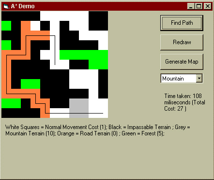

<div align="center">

## Astrid


</div>

### Description

A demo of the A* (A star) pathing algorithm used in many games to find a path across a varied map. This is merely a demo, but with optimisation it could be modified to be used in a game. Most tiled map games, board games (such as chess), and route finders all use the A* pathing algorithm as a quick an efficient method of finding a route from A to B.

The code also contains my implementation of a Heap or Binary Tree (which is sadly lacking from VB).
 
### More Info
 
A* is based on graph theory, and has many implementations. Numerous links are included in the code for the user to find out more


<span>             |<span>
---                |---
**Submitted On**   |2000-10-26 18:51:00
**By**             |[BigCalm](https://github.com/Planet-Source-Code/PSCIndex/blob/master/ByAuthor/bigcalm.md)
**Level**          |Intermediate
**User Rating**    |4.8 (53 globes from 11 users)
**Compatibility**  |VB 5\.0, VB 6\.0
**Category**       |[Games](https://github.com/Planet-Source-Code/PSCIndex/blob/master/ByCategory/games__1-38.md)
**World**          |[Visual Basic](https://github.com/Planet-Source-Code/PSCIndex/blob/master/ByWorld/visual-basic.md)
**Archive File**   |[CODE\_UPLOAD114851182000\.zip](https://github.com/Planet-Source-Code/bigcalm-astrid__1-12653/archive/master.zip)

### API Declarations

```
Declare Function BitBlt Lib "gdi32" (ByVal hDestDC As Long, ByVal X As Long, ByVal Y As Long, ByVal nWidth As Long, ByVal nHeight As Long, ByVal hSrcDC As Long, ByVal xSrc As Long, ByVal ySrc As Long, ByVal dwRop As Long) As Long
Public Const BLACKNESS = &H42
Public Const WHITENESS = &HFF0062
Declare Function timeGetTime Lib "winmm.dll" () As Long
```


